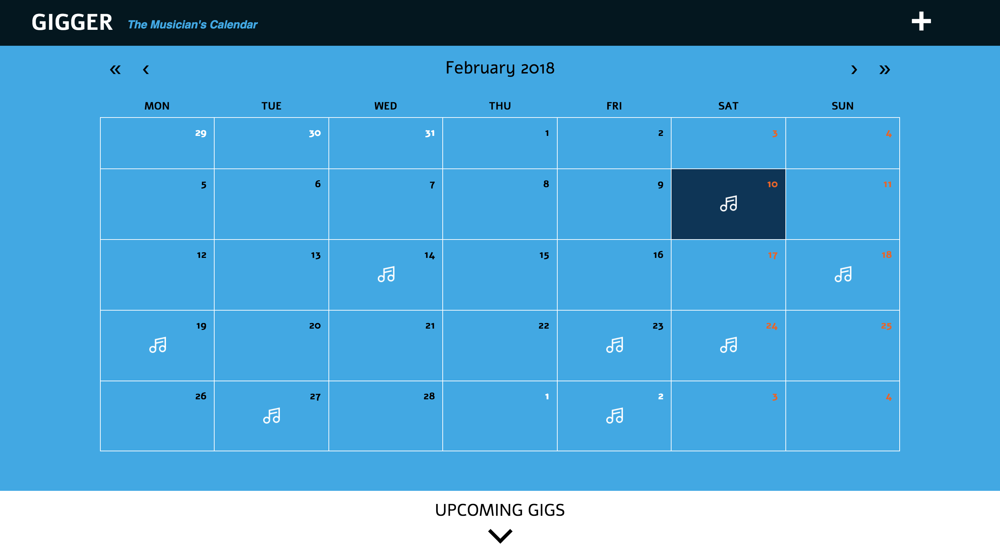
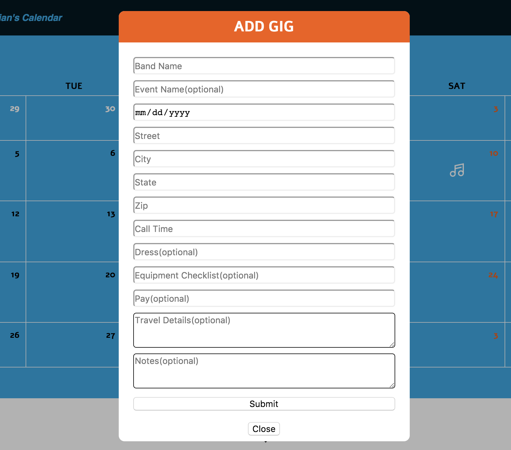
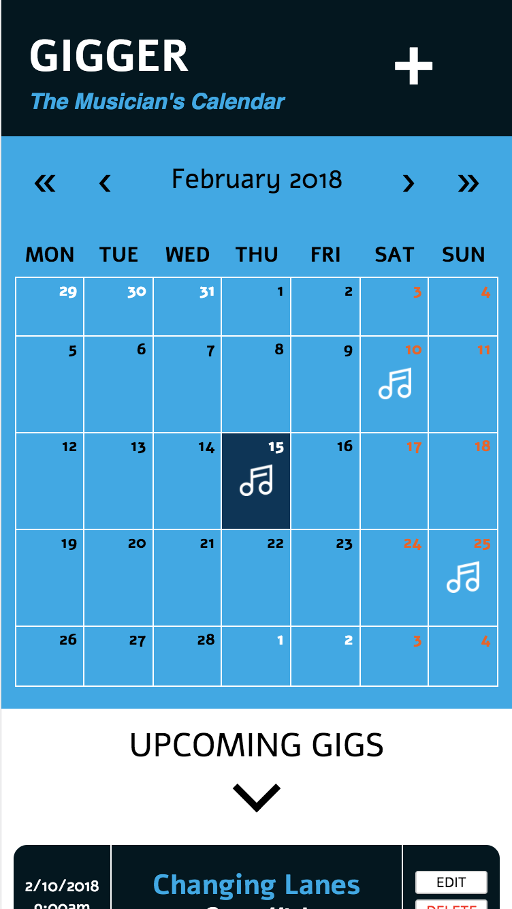
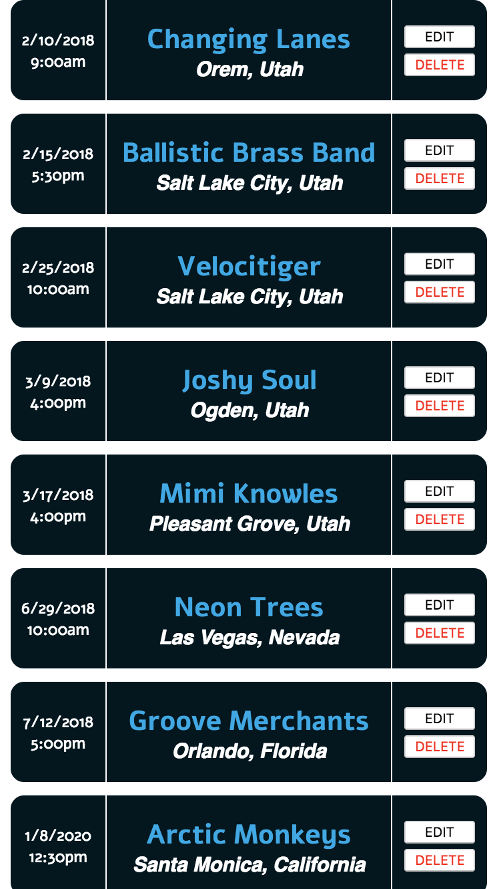
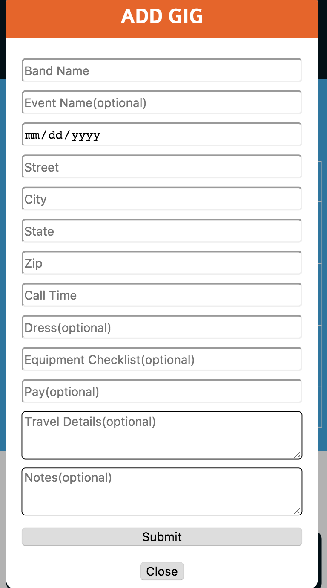

# Gigger

Celeste Robinson

## Objective

Provide a way for myself and other professional musicians to keep track of gig commitments, and keep all gig details in one place. This calendar app should provide users a way to add new gigs, with all of the gig information including who it's with, where it is, the dress and equpiment required, the call time, etc. It should be basic, user-friendly, and responsive. At a quick glance, the user should be able to see the upcoming month, and when they have gigs. On clicking a gig, they should be able to see the full gig details.

### Web Views

##### Main Web View


##### Gig List Web View


##### Add Gig Web View


Main Mobile View | Gig List Mobile View | Add Gig Mobile View
--- | --- | ---
 |  | 

## Links

Github Repository: https://github.com/celesterobinson/gigger

## Technologies Used
* HTML, CSS, JavaScript, React, Redux + Thunk, Axios
* Node, Expess + Middleware, MongoDB, Mongoose

## Code Example

The main challenge of building this app was getting used to how ```Date``` objects function. I ended up using a packaged called Moment that allowed me to manipulate the format of displayed dates from my database, and compare those dates to the dates from the calendar. 

In the below code, I use a prop called ```tileContent``` from the react-calendar package to display a symbol on the days of the calendar that currently have a scheduled gig. The ```tileContent``` function runs on every day of the displayed month. If the user is on the view of a month, the date is turned into moment date. The function then searches through the data for a gig object that has the same date as the moment date. It tests if the dates are the same, and returns true or false. If it's true, the date has the image displayed on it. :)

```
tileContent({date, view}) {
    if (view === "month") {
        const momentDate = moment(date)
        const gig = this.props.gig.data.find(gig => {
            const gigDate = moment(gig.date)
            return momentDate.isSame(gigDate, "day");
        });
        return gig && ;
    }
}
```

## Wireframes

Being an actively gigging musician, there is a ton of information that is difficult to keep track of. There have been many times where I have accidentally double booked myself, forgetting that I had already committed to a gig. This makes band leaders super angry. I have been wanting to build an app for a few years now that is a calendar specifically for musicians. In the future I might expand it to all arts-based freelancers. The goal of this app is to provide a more detailed platform for musicians. Event inputs will include info like call time, dress, pay, set-list, and event schedule.

MVP 
* Full-stack
* Responsive
* Allows user to create new events
* Each event has at least this inputs
    * Gig name
    * Gig band name
    * Gig address
    * Call time
    * Dress
    * Equipment needed
    * Gig pay (optional)
    * Flight details (optional)
* Send warning if two gigs are booked at the same time
* Displays calendar with some type of symbols displayed on days with events

User Story
* Homepage should be view of calendar of the next month with upcoming event(s) underneath it
* + button to add a new event
* List of upcoming # of gigs.
* When you click on a day/event, displays all info about that gig
* Option there to delete or edit current gig

## Future Ideas

* The equipment list should be a checklist, so that before a gig you can check off the items you need for that specific gig. Forgetting things is the WORST.

