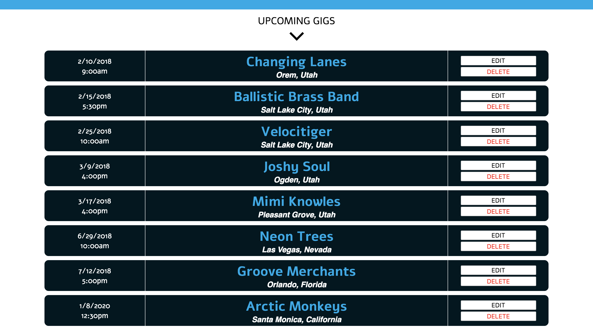

# Gigger

Celeste Robinson

## Objective

Provide a way for myself and other professional musicians to keep track of gig commitments, and keep all gig details in one place. This calendar app should provide users a way to add new gigs, with all of the gig information including who it's with, where it is, the dress and equpiment required, the call time, etc. It should be basic, user-friendly, and responsive. At a quick glance, the user should be able to see the upcoming month, and when they have gigs. On clicking a gig, they should be able to see the full gig details.

### Web Views

##### Main Web View

##### Gig List Web View

##### Add Gig Web View

Main Mobile View | Gig List Mobile View | Add Gig Mobile View
--- | --- | ---
 |  | 

## Links

Github Repository: https://github.com/celesterobinson/gigger

## Technologies Used
* HTML, CSS, JavaScript, React, Redux + Thunk, Axios
* Node, Expess + Middleware, MongoDB, Mongoose